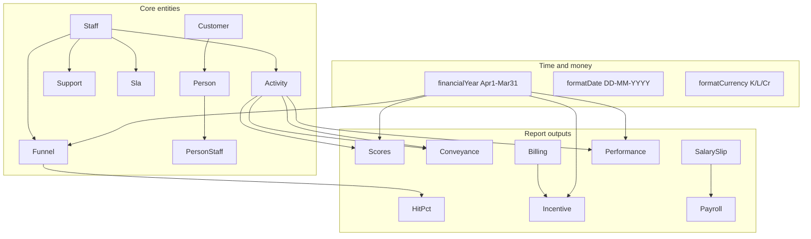

# Aumraj CRM — Functional Specification

Customer-style functional documentation for **aumraj-crm**: business domains, workflows, permissions, report formulas, and API behavior as implemented today (including known quirks). For engineering findings, see [LOGIC_REVIEW.md](../LOGIC_REVIEW.md).

## Index

| # | Document | Domain |
|---|----------|--------|
| 01 | [roles-and-access.md](./01-roles-and-access.md) | Staff, admin, group head, JWT, middleware |
| 02 | [activity-and-scoring.md](./02-activity-and-scoring.md) | Activity types, validation, scoring workflow |
| 03 | [funnel-pipeline.md](./03-funnel-pipeline.md) | Pipeline statuses, hit %, charts, exports |
| 04 | [support-and-sla.md](./04-support-and-sla.md) | Support tickets, AMC/SLA lifecycle, PDFs |
| 05 | [customers-and-contacts.md](./05-customers-and-contacts.md) | Companies, contacts, search, merge |
| 06 | [reports-scores-and-incentives.md](./06-reports-scores-and-incentives.md) | Score pivot, FY averages, incentive tiers |
| 07 | [reports-conveyance-and-activity.md](./07-reports-conveyance-and-activity.md) | Activity grids, conveyance formula |
| 08 | [salary-and-payroll.md](./08-salary-and-payroll.md) | Salary slips, base/HRA/NSP, PDF export |
| 09 | [billing-and-dashboard.md](./09-billing-and-dashboard.md) | Billing target, KPIs, performance SQL |
| 10 | [groups-tasks-notifications.md](./10-groups-tasks-notifications.md) | Groups, tasks, notification triggers |
| 11 | [settings-and-enums.md](./11-settings-and-enums.md) | Settings JSON, const fallbacks |
| 12 | [shared-calculations-and-dates.md](./12-shared-calculations-and-dates.md) | FY, formatDate, prismaFilter, currency |

## Domain map

## Financial year (India)

Defined in `src/libs/consts.ts` as `financialYear()`:

- **Start:** April 1 of start year  
- **End:** March 31 of end year  
- If current calendar month index ≥ 3 (April–December): FY = `year` → `year+1`  
- If January–March: FY = `year-1` → `year`

Used by: performance dashboard, funnel summaries (closure in FY), score FY filtering, incentive `workMonths`, top Won PO queries.

## Glossary

| Term | Meaning |
|------|---------|
| **Staff** | `Staffs` row — field sales / operations user with login |
| **Admin** | Staff with `permissions.admin = true`; `/admin/*` UI |
| **Group head** | Staff where `group.headId = staff.id`; `/group/*` UI |
| **Activity** | Daily work log (`activity` table): Meeting, Office, or Telecalling |
| **Score** | Integer on activity after admin/group head review; drives incentives |
| **Funnel** | Sales opportunity pipeline record |
| **Hit %** | `wonCases / totalFunnelCases × 100` for a period |
| **Conveyance** | Reimbursement for Meeting travel: `distance × conveyanceCost + parkingCost` |
| **NSP** | Net salary payable (derived on client; also stored as `netSalary`) |
| **Billing %** | Latest `BillingData.amount / Settings.target × 100` |
| **FY score (dashboard)** | Per month: sum of daily `MAX(score)` per staff, then averaged across team |
| **FY score (score report)** | Per month key: **sum of all activity row scores** (differs from dashboard) |
| **PersonStaff** | Link table scoping which contacts a staff may see |
| **Settings** | Single-row config: JSON dropdowns + numeric `target` |
| **Terminal funnel status** | Won, Lost, Dropped — used in UI/SQL but **not** in Settings `funnelStatus` JSON |
| **Open pipeline** | Default filter Hot, Mild, Cold |

## Key formulas (quick reference)

| Domain | Formula |
|--------|---------|
| Conveyance (Meeting) | `distance × staffs.conveyanceCost + parkingCost` (default rate **6**) |
| Salary base | `(salary / 30) × (2/3) × paidDays` |
| Salary HRA | `(salary / 30) × (1/3) × paidDays` |
| NSP (client) | `round(base + hra - ec - tds - loan - others)` |
| Funnel hit % | `wonCases / totalFunnelCases × 100` |
| Incentive tier | avg ≥250 → 25%; ≥200 → 15%; ≥150 → 6% of `billingPercentage × salary × workMonths` |
| Performance monthly | `SUM(daily MAX(score))` per calendar month |
| Billing % | `latest BillingData.amount / Settings.target × 100` |

## Application surfaces

| Path prefix | Audience | Auth |
|-------------|----------|------|
| `/users` | All logged-in staff | JWT session |
| `/group` | Group heads | Session + group flags |
| `/admin` | Admins | Session + `admin` flag + middleware |

## API layout

Roughly **98** route handlers under `src/app/api/` — user, group, admin, auth, settings. Each domain doc lists the routes relevant to that area.

## Document template

Every numbered spec uses:

- **Purpose** — business problem  
- **Actors** — who can act  
- **Inputs** — forms, filters, defaults  
- **Business rules** — validation, scoping, transitions  
- **Calculations** — formulas with DB field names  
- **Outputs** — grids, charts, exports  
- **API endpoints** — route table  
- **Edge cases** — quirks; link to LOGIC_REVIEW when unintentional  

## Related docs

- [LOCAL_DEV.md](../LOCAL_DEV.md) — run locally  
- [LOGIC_REVIEW.md](../LOGIC_REVIEW.md) — prioritized logic/security issues  
- [DATABASE_MIGRATION.md](../DATABASE_MIGRATION.md) — schema migration  
